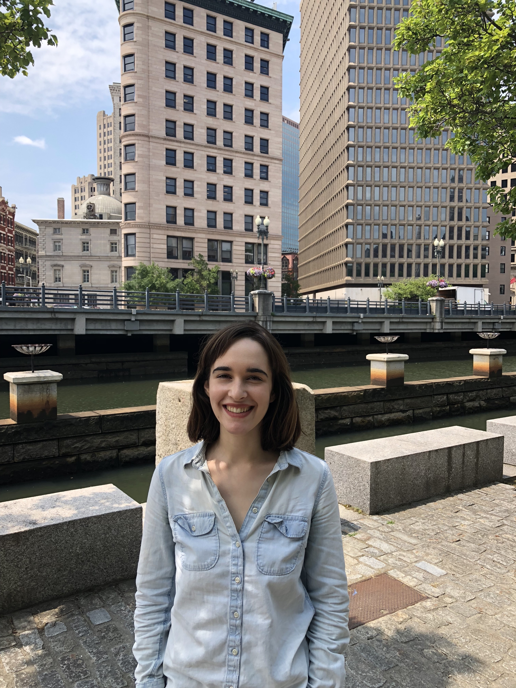

---
---

<link rel="stylesheet" href="styles.css" type="text/css">

I am a third-year doctoral student in the [Department of Biostatistics](https://www.brown.edu/academics/public-health/biostats/home) at the Brown University School of Public Health, where I explore interpretability in machine learning and Bayesian methodology under the advisement of [Dr. Lorin Crawford](http://www.lcrawlab.com).

I was a member of the inaugural [Data Science Development Program](https://datascience.massmutual.com/dsdp) class at MassMutual Financial Group. While working full-time as a data scientist, I pursued an M.S. in Statistics from the University of Massachusetts Amherst. I am a proud Smith College alumna.

In my spare time, I am training for my second marathon and teaching my dog to high paw.

My full CV is available [here](CV.pdf).